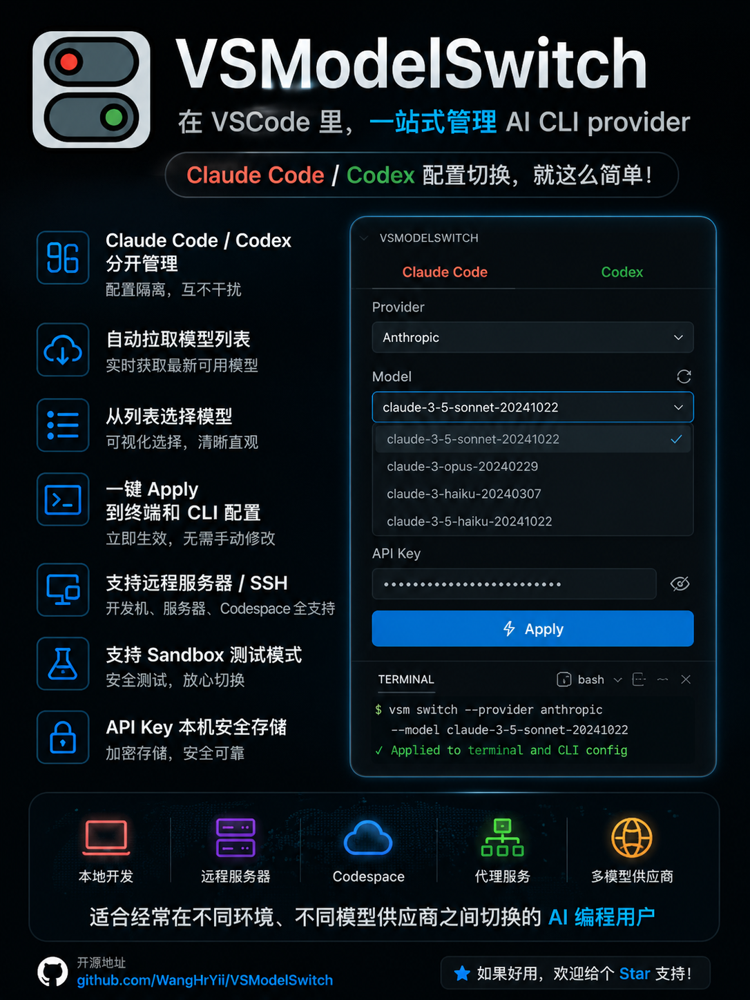

# VSCodeModelSwitch

English | [简体中文](README.zh-CN.md)

VSCodeModelSwitch is a VS Code extension for maintaining and switching Claude
Code and Codex API providers. Provider metadata is managed in one sidebar while
API keys remain in VS Code SecretStorage until a provider is applied.

Repository: [XinZhaoDC/VSCodeModelSwitch](https://github.com/XinZhaoDC/VSCodeModelSwitch)

This private derivative is maintained independently from the original
VSModelSwitch project. Its MIT license and attribution are preserved in
[`LICENSE`](LICENSE).

<p align="center">
  
</p>

## What It Does

- Keeps Claude Code and Codex providers, active states, and tool locks separate.
- Adds providers from key fields or a complete JSON/TOML configuration.
- Fetches model suggestions when `/models` is supported, while still allowing a
  manual or empty Model ID.
- Applies a provider by backing up and fully replacing the selected CLI config.
- Matches the applied provider by normalized Base URL plus API key; a trailing
  `/v1` does not create a different identity.
- Edits stored provider configuration and secrets before Apply.
- Provides on-demand network, model compatibility, and optional usage checks.
- Imports and exports provider metadata with API keys removed.
- Shows log and backup sizes and provides scoped deletion controls.

## Requirements And Installation

- VS Code 1.96 or newer.
- Node.js 22 is recommended when building from source.
- Claude Code and/or Codex must be installed separately to use their terminals.

Install a locally built release through:

```text
Extensions -> ... -> Install from VSIX...
```

Select `vscodemodelswitch-<version>.vsix`, then run:

```text
Developer: Reload Window
```

## Safe First Run

Apply fully replaces a target configuration, so test in sandbox mode first.
Open `Preferences: Open Workspace Settings (JSON)` from the Command Palette and
set:

```json
{
  "vscodemodelswitch.globalCliSync": true,
  "vscodemodelswitch.configTarget": "sandbox",
  "vscodemodelswitch.testHome": ""
}
```

The default sandbox location is:

```text
<workspace>/.vscodemodelswitch-home/
```

Real mode targets the effective user home:

```text
~/.claude/settings.json
~/.codex/config.toml
```

Before each replacement, the previous file is copied to:

```text
~/.claude/vscodemodelswitchbak/
~/.codex/vscodemodelswitchbak/
```

The same relative layout is used under the sandbox home.

## Usage

### 1. Enable A Tool

Open the VSCodeModelSwitch Activity Bar view. Each Claude/Codex section has an
`Enabled` operation lock and a collapse control. Disabling a tool prevents
changes while `Applied Config` remains available for inspection.

### 2. Add A Provider

`Key fields` mode requires only:

- Tool
- Name
- Base URL
- API Key

`Fetch Models` loads suggestions when the provider implements a compatible
models endpoint. Failure is only a warning: enter a Model ID manually or leave
it empty. An empty model is displayed as `NULL` and can be configured later.
`Set active after saving` is off by default.

`Full configuration` mode starts from the complete Claude JSON or Codex TOML
template. Fill the Base URL and API key in their defined locations, then edit or
remove any other fields as needed. Model and Claude `effortLevel` may be empty
or omitted. Duplicate JSON/TOML fields are rejected.

Recognized key locations are:

```text
Claude: env.ANTHROPIC_AUTH_TOKEN
Codex:  model_providers.OpenAI.experimental_bearer_token
```

The key is removed from stored/exported configuration text and saved in
SecretStorage. Apply necessarily writes it into the selected Claude/Codex CLI
config file so those tools can authenticate.

### 3. Apply And Edit

- `Apply`: back up and fully replace only that tool's selected config file.
- `Config`: edit the stored complete configuration and key before applying it.
- `Model`: refresh suggestions and update the stored model.
- `Delete`: remove provider metadata and stored secrets after confirmation. It
  does not remove the already applied CLI config or backups.
- `Applied Config`: open the file currently used for status matching.

The global table shows `Off`, `Unactivated`, `Ready`, `Key missing`,
`Models stale`, `Degraded`, or `Network error`. Provider and Model are `NULL`
when the tool is off/unactivated; Model is also `NULL` when the applied config
does not specify one.

### 4. Network And Usage

- `Network & Usage` checks basic reachability and models endpoints. Tool-level
  checks run at most two providers concurrently and can be cancelled.
- `Verify Model` sends a minimal `/v1/messages` (Claude) or `/v1/responses`
  (Codex) request. It may consume a very small amount of API quota.
- Usage is optional. `Auto Detect` tries common same-origin balance endpoints
  for up to 20 seconds. Many relays do not expose balance through a model API
  key; New API-style services require a separate Management Access Token and
  User ID. A failed usage query does not mean model requests are unusable.

VSCodeModelSwitch uses the network route of the remote/container extension host.
VPN TUN routing therefore depends on the container's DNS and route, not only on
whether the host browser can open a provider website.

### 5. Logs, Backups, Import And Export

Open `View -> Output` and select `VSCodeModelSwitch` for sanitized request
diagnostics. Logs never include API keys or raw response bodies. The global
status area shows the current extension log-folder size and backup sizes.

`Delete Log` removes only this extension's current log files. Each tool has its
own `Delete Backups` action. Both require confirmation.

`Export` writes full provider templates and metadata but clears API keys and
management tokens. `Import` rejects duplicate provider names within the same
tool. Imported providers require keys to be entered locally through `Config`.

## Build From Source

Use the lockfile for reproducible dependencies:

```bash
npm ci
npm run check
npm run compile
npm run package
```

Generated artifacts are ignored by Git:

```text
node_modules/
out/
*.vsix
.vscodemodelswitch-home/
```

The container-specific Node environment and VSIX workflow are documented in
[`AI_Prompt/01-独立环境安装与VSIX构建.md`](AI_Prompt/01-独立环境安装与VSIX构建.md).

## Local Sandbox Test

1. Configure sandbox mode as shown above.
2. Start the local endpoint in a separate terminal with `npm run mock:models`.
3. Add Claude with Base URL `http://localhost:8787` and key `test-key`.
4. Fetch or enter `claude-sonnet-4-20250514`, save without auto-activation, and
   click `Apply`.
5. Repeat for Codex with `gpt-5-codex`.
6. Confirm the generated files exist below `.vscodemodelswitch-home/` and match
   the selected providers.
7. Run `Network & Usage` and `Verify Model` on both providers.
8. Apply a second time and confirm backup size increases.
9. Export configuration and verify that `test-key` is absent.
10. Delete a provider and confirm the applied file remains unchanged.

The complete regression checklist is in [`docs/validation.md`](docs/validation.md).

## Security Notes

- Never commit exported files without inspecting them, even though normal Export
  removes recognized secrets.
- API keys are intentionally written into CLI configs on Apply; protect the
  effective home and backup directories accordingly.
- Usage auto-detection only derives paths on the configured provider origin. It
  does not send credentials to unrelated domains.
- This extension does not implement an HTTP proxy or intercept Claude/Codex
  traffic, so it cannot calculate authoritative usage when a provider exposes no
  usage API.

## License

MIT
